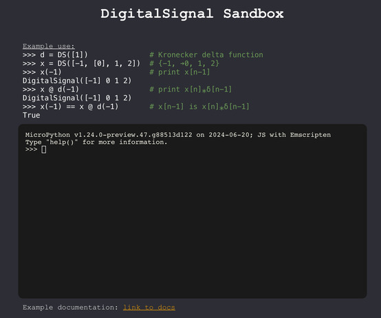

# Use DigitalSignal Sandbox in browser
GitHub Page Site: [https://caden-cardell.github.io/DigitalSignal/](https://caden-cardell.github.io/DigitalSignal/)  
  

  
This site is based on [pyscript.net](https://pyscript.net/), the source code for which can be found [here](https://github.com/pyscript/pyscript.net).

# Installation Guide
Follow these steps to set up and install the package:

### 1. **Create a new directory**:
```bash
mkdir my_project
cd my_project
```

### 2. **Create a virtual environment**:
```bash
python3 -m venv venv
```

### 3. **Activate the virtual environment**:
On macOS and Linux:
```bash
source venv/bin/activate
```
On Windows:
```bash
venv\Scripts\activate
```

### 4. **Install the package**:
```bash
pip install git+https://github.com/caden-cardell/DigitalSignal.git@<release version>
```

# Examples

### Import
```python
from DigitalSignal import DigitalSignal as DS
```

### Instantiating
Bracket notation denotes where the zero index is. If no bracket is given then the first element is defaulted to as the zero index.
```
d = DS([1])              # Kronecker delta function
x1 = DS([0, 1, 2, 3])    # represents a signal with sequence notation {➔0, 1, 2, 3}
x2 = DS([[0], 1, 2, 3])  # {➔0, 1, 2, 3}
x3 = DS([0, 1, [2], 3])  # {0, 1, ➔2, 3}
x4 = DS()                # {} or {➔0}

print(d)  # DigitalSignal([1])
print(x1)  # DigitalSignal([0] 1 2 3)
print(x2)  # DigitalSignal([0] 1 2 3)
print(x3)  # DigitalSignal(0 1 [2] 3)
print(x4)  # DigitalSignal([0])
```

### Indexing
The DigitalSignal class supports negative indexing and indexing out of range. Indexing out of range returns '0'.
```
x = DS([1, [2], 3, 4])  # {1, ➔2, 3, 4}

print(x)  # DigitalSignal(1 [2] 3, 4)

# x[-1] is x[n] when n=-1.
# NOTE: Not to be confused with x(-1) which is a time-shift operator that is equivalent to x[n-1]!!
print(x[-100])  # 0
...
print(x[-3])    # 0
print(x[-2])    # 0
print(x[-1])    # 1
print(x[0])     # 2
print(x[1])     # 3
print(x[2])     # 4
print(x[3])     # 0
...
print(x[100])   # 0
```

### Time-shifting
The notation $y[n] = x[n-1]$ is not possible so instead y = x(-1), then y can be indexed y[n].
```python
x = DS([1, 1, 1, -1, 1])  # Barker Code 5
print(x)  # DigitalSignal([1] 1 1 -1 1)

y = x(-1)
print(y)  # DigitalSignal([0] 1 1 1 -1 1)
```

### Negation
```python
x = DS([1, 1, 1, -1, 1])  # Barker Code 5
print(x)  # DigitalSignal([1] 1 1 -1 1)

y = -x
print(y)  # DigitalSignal([-1] -1 -1 1 -1)
```

### Scalar multiplication
```python
x = DS([1, 1, 1, -1, 1])  # Barker Code 5
print(x)  # DigitalSignal([1] 1 1 -1 1)

y = 2*x
print(y)  # DigitalSignal([2] 2 2 -2 2)
```

### Addition about the zero index
```python
x1 = DS([-2, -1, [0]]) 
print(x1)  # DigitalSignal(-2 -1 [0])

x2 = DS([[0], 1, 2]) 

y = x1 + x2
print(y)  # DigitalSignal(-2 -1 [0] 1 2)
```

### Folding
The notation $y[n] = x[-n]$ is not possible so instead y = ~x, then y can be indexed y[n].
```python
x = DS([-2, -1, [0], 1, 2, 3, 4, 5])
print(x)  # DigitalSignal(-2 -1 [0] 1 2 3 4 5)

y = ~x
print(y)  # DigitalSignal(5 4 3 2 1 [0] -1 -2)
```

### Operator combinations
```python
x = DS([1, 1, -1])  # Barker Code 3
print(x)  # DigitalSignal([1] 1 -1)

y = 2*x - x(-4)  # y[n] = 2x[n]-x[n-4]
print(y)  # DigitalSignal([2] 2 -2 0 -1 -1 1)
```

### Folding and time-shifting
The following *DigitalSignal* notation is equivalent to $y[n] = x[-n-2]$.
```python
x = DS([1, 2, 3])  
print(x)  # DigitalSignal([1] 2 3)

y = ~x(-2)
print(x)  # DigitalSignal(3 2 1 0 [0])
```
The following *DigitalSignal* notation is equivalent to $y[n] = x[-(n-2)]$.
```python
x = DS([1, 2, 3])  
print(x)  # DigitalSignal([1] 2 3)

y = (~x)(-2)
print(x)  # DigitalSignal([3] 2 1)
```

### Convolution
```python
x = DS([0, 1, 2, 3])  
print(x)  # DigitalSignal([0] 1 2 3)

h = DS([1, 1])
print(x)  # DigitalSignal([1] 1)

y = x @ h  # y[n] = x[n] ∗ h[n]
print(y)  # DigitalSignal(0 0 0 [0] 1 3 5 3)
```

### Correlation 
$r_{xx}[n] = x[n] * x[-n]$. Currently only real-valued signals are supported.
```python
x = DS([1, 1, 1, -1, 1])  # Barker Code 5
print(x)  # DigitalSignal([1] 1 1 -1 1)

r_xx = x % x  # the autocorrelation of x

print(r_xx)  # DigitalSignal(1 0 1 0 [5] 0 1 0 1)
```

### Equality 
```python
d = DS([1])  # Kronecker delta function
print(d)  # DigitalSignal([1])

x = DS([[1], 2, 3])
print(x)  # DigitalSignal([1] 2 3)

# time-shifted x
print(x(2))  # DigitalSignal(1 2 [3])

# x convolved with a time-shifted Kronecker delta function
print(x @ d(2))  # DigitalSignal(1 2 [3] 0 0)

# these are equivalent operations
print(x(2) == x @ d(2))  # True
```
